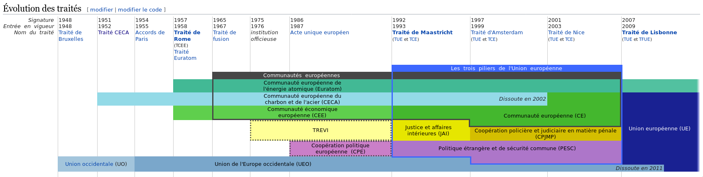

# Droit matériel de l'UE : Droit du Marché Interieur

[TOC]

- Examen Terminale : 12e Semaine de cours.

- Examen Mi-semestre, écrit, 1/2h  ou 45min, prevenu à l'avance, mi-semestre, 1/3 du note

  ​

# INTRODUCTION

## i. Evolution de l'UE et son influence sur le droit européen

### 1. Histoirique de l'évolution de l'UE

- 1949 : conseil de l'europe traité de londres

- REVISE GODDAMNIT

- CECA ; Traité de paris 51 => terminé en 2001

- **CEE : Traité de Rome, Euratom**

- **1986 : L'acte Unique européen (acte unique qui modifie les 3 traités)**

- **1992 : Traité de Maastricht : Création de l'*Union Européenne***

  - Le CEE devient le CE, Elle a plus qu'un but économique
  - Protéction de l'Environnement et autre => Création du JAI, du PESC
  - cooperation judiciaire (madat arrêt européen)
  - visa/asyl/immigration

  - Vu que Les états membres du CEE peuvent "perdre la main" lors des négotiations **Ils ont crée l'UE** pour avoir un cadre dans lequel ils pourraient négotier les "politiques sensibles" 
    - cooperation judiciaire (madat arrêt européen)
    - visa/asyl/immigration
  - A partir de  plusieurs traités : 2 traités :
    - L'UE qui comprends un sous-ensemble : la CE

- **Amsterdam / Nice : peu de modifications**
  - On commence à faire passer des politiques de l'UE au cadre du CE (coopération judiciaire)

- **2007 : Lisbon**
  - Entré en vigeur le 1er décembre 2009
  - Fait converger les institutions vers une seule : l'UE
  - Formellement, l'UE repose sur deux traités, qui ont le meme valeur : 
    - TUE (Traité de Maastricht (modified multiple times)
      - les grands principles, objectives, les principales institutions, "PESC => Politique étrangère et sécurité commune"
    - TFUE (Traité sur le Fonctionnement de l'Union Européenne)
      - annexes, protocols etc ..
  - Les autres pays n'ont jamais signé le traité de rome
    - Traités d'adhésion : chaque adhérant a négotié et conclu une traité d'adhésion (22 en totale)

- **Traité de constitution pour l'Europe (2005):**

  - ***<u>Aurait simpliié tout mais non bien il fallait faire chier</u>***

- Difference entre simple traité et la création d'une organisation internationale :

  - Création d'une *personne morale*
  - l'UE a son propre interet, budget, droits, obligations, institutions
  - *Paranthèse Juridique*:
    - On distingue 2 types de personnes : 
      - Les Individus (Personnes physiques)
        - Existe Individuellement
        - a des droits et des obligations propres
      - Les Personnes Morales :
        - états, associations, entreprises, communes etc ...
        - Ils ont des *organes*:
          - des personnes qui vont agir pour l'organisation
  - Quand on crée une organisation internationale il faut créer des *organes*

### 2. Les Institutions :

- **La Commission Européenne:**
  - Répresente les interets propres de l'UE
  - **Le Président de la Commission**
    - Proposé par le *Conseil Européen*
    - Confirmé par le parlement : la répresentant du parti avec la majorité
  - **Les autres commissaires :**
    - désignés par les états membres
    - Le président reparti les commissaires
    - Le parlement doit aprouver la commission

  - **Le Parlement Européen**
    - Répresente *les peuples* des états membres (non un seul peuple européen)
    - élus au souffrage universelle directe proportionel (751)
    -  plus l'état est peuplé, plus il a de sièges
  - **Conseil de l'Union Européen (Conseil des ministres)**
    - Les membres des gouvernements des 28 états membres y siègent.
    - Differentes membres selon domaines.
    - Les interêts des états
  - **Conseil Européen**
    - Chefs d'états / de gouvernement
    - cadre de discussion
    - ne fait pas de décisions
  - **Cour de Justice de l'Union Européenne**
    - Au pars avant : CJCE (Cour de justice *des* communautés européens)

### 3. La Législation

- Les traités prévoit que l'UE puisse agir d'elle même en adoptant des *textes de droit* => des ***actes juridiques***

  - Ils peuvent *légifier*, en adoptant :
    - **Actes de porté générale** (définissent des règles générales, s'adresse à tous le monde) => règlement intérieur / **actes législatives**
      - *Règlement*
        - Appliqué directement
        - crée des droits et des obligations pour les **individus**
      - *Directives*
        - Règles générales transposés par les états des pays membres
        - Crée des droits et des obligations **pour les états**
        - L'UE laisse un délai pour la transposition
    - **Les décisions de justice (prises par la CJUE)** :
      - *Les Arrêts et Ordanances*
    - **Actes individuelles** (qui visent, désignent éxclusivement une ou plusieurs personnes) => diplome
      - *décisions*
        - Condamnation à amende des entreprises (Google) (décision de la commission)
    - **Procédure législative ordinaire**
      1. Commission propose

      - Represente les interets de l'UE (tous le monde)

      2. Le Conseil de l'Union le valide ou l'ammender

      - Represente les interets des pays

      3. Le Parlement le valide ou l'ammende

      - Represente les interets des peuples

      - **trilogue** : les discussions informelles entre les institutions pour accélerer l'adoption des lois
    - **Procédure législative spéciale**:
      - Le PE est seulment consulté
      - Conseil des ministres doit se mettre d'accord TOUS

### 4. La Cour de Justice de l'UE

- 2 juridictions :
  - Cour de Justice => Juridiction suprème
  - Tribunale de l'Union => 1ère instance dans certaines matières
- A **Luxembourg** : Le Cour de Justice de l'Union Européenne
  - Chargé de vérifier le respect de droit de l'UE
    - Les États, Les institutions de l'Union (la législation),
- Elle intervient de 2 manières :
  - Directement Saisie (***Recours Directe***)
    - 1er : *Recours en manquement* 
      - A pour but de vérifier qu'un état respecte bien le droit de l'unon européenne
      - La Comission peut saisir la cour dans le cadre d'un recours en manquement
      - Les états peuvent aussi faire ça
    - 2e : *Recours en annulation*
      - Quand une institution de l'UE prends une décision qui ne respecte pas le droit européen
      - Peut être prise par un état, une institution, une personne physique ou morale
      - Si le traité est violé, le cour annule la directive

  - Indirectement Saisie ()

    ​

## I) L’objet du droit du marché intérieur : l’intégration économique par le droit

## II) Les étapes de la réalisation du marché intérieur

# CHAPITRE I) LES MARCHANDISES

## I) le champ d’application des règles relatives aux marchandises

###	A) La notion de marchandise

testing

###	B) L’origine des marchandises

###	C) La dimension transnationale de l’échange de marchandises

## II) L’Union douanière

### 	A) Le régime des échanges avec les États tiers

####		1) L’élaboration d’une réglementation douanière commune

#### 		2) L’Union douanière et l’action générale de l’Union européenne

### 	B) Le régime des échanges entre les États membres

#### 		1) Le démantèlement des droits de douanes

#### 		2) L’interdiction de certains prélèvements obligatoires

##### 			a) L’interdiction des taxes d’effet équivalent aux droits de douanes

##### 			b) L’interdiction des impositions intérieures discriminatoires ou protectionnistes

##### 			c) La récupération des impositions perçues en violation du droit del’Union

## III) L’interdiction des restrictions quantitatives au commerce entre les États membres

### 	A) Le champ de l’interdiction : la notion de mesure d’effet équivalent à une restriction quantitative

#### 		1) La définition originelle des mesures d’effet équivalent à une restriction quantitative

#### 		2) L’arrêt Keck et Mithouard

#### 		3) Le retour du critère de l’entrave ?

#### 		4) Les principes applicables en l’état du droit

### 	B) Les exceptions à l’interdiction des mesures d’effet équivalent à des restrictions quantitatives

#### 		1) Les exceptions prévues par le Traité

#### 		2) Les exceptions jurisprudentielles

#### 		3) Le régime des exceptions

## IV) Le rapprochement des législations nationales

### 	A) Les fondements de l’harmonisation des législations

### 	B) Les techniques de l’harmonisation des législations

# CHAPITRE II) LES PERSONNES ET LES SERVICES

## I) Les bénéficiaires des libertés de circulation

###  A) Les conditions générales du bénéfice des libertés de circulation

#### 1) Le lien avec un État membre

##### a) Le lien pour les personnes physiques : la condition de nationalité

##### b) Le lien pour les sociétés : la constitution en vertu du droit national

#### 		2) Une situation transnationale

### 	B) Les conditions particulières à chaque liberté

#### 		1) Les bénéficiaires de la libre circulation des travailleurs

#### 		2) Les bénéficiaires du droit d’établissement

#### 		3) Les bénéficiaires de la libre prestation de services

### 	C) Le statut général de toute personne physique : la citoyenneté européenne

# II) Les droits attachés aux libertés de circulation

## 	A) Les droits de circulation et de séjour des personnes physiques

### 		1) Les personnes physiques concernées

### 		2) Le droit de circuler entre les territoires des États membres

### 		3) Le droit de séjour sur le territoire de l’État d’accueil

##### 			a) Le séjour jusqu’à trois mois

##### 			b) Le séjour de trois mois à cinq ans

##### 			c) Le séjour permanent

#### 		4) Les limitations du droit d’entrée et de séjour

## 	B) Les droits liés à l’accès et à l’exercice d’une activité économique

#### 		1) Les mesures interdites en principe par le traité

#### 		2) La justification des mesures nationales constitutives de discriminations ou d’entraves

#### 		3) La situation particulière des emplois dans la fonction publique ou participant à l’exercice de l’autorité publique

## 	C) Les droits politiques du citoyen

#### 		1) Les droits liés aux élections au Parlement européen

#### 		2) Le droit de vote et d’éligibilité aux élections locales

#### 		3) L’initiative populaire

# III) CHAPITRE 3 Études de cas

## 	A) Le détachement de travailleurs

## 	B) Le marché des jeux de hasard
